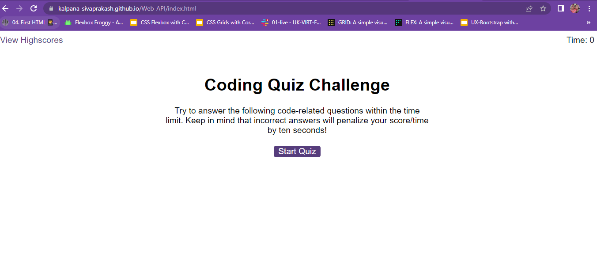
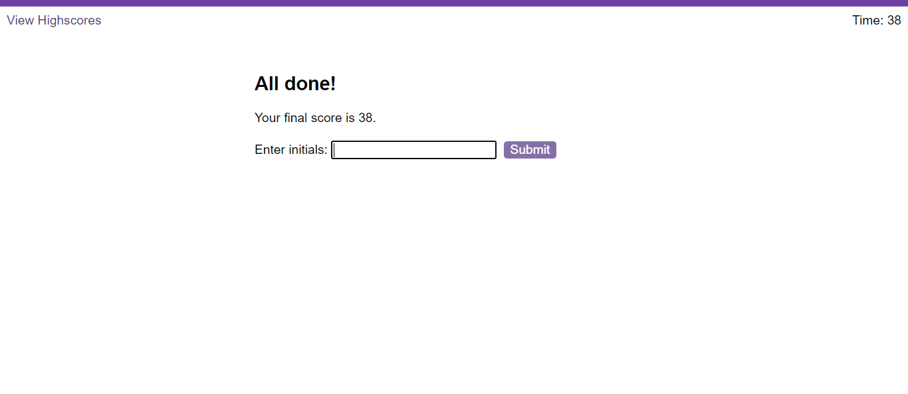

# Web APIs: Code Quiz

## Description
Coding assessment is created with a combination of multiple-choice questions and interactive coding Challenges. when the start button is clicked timer also starts and displays the multiple choice questions. If the selected choice is either correct or wrong it shows at the end of each question. If the answer is incorrect, the time is subtracted from the clock. finally the saved score is displayed.

# Deployed Link:

https://kalpana-sivaprakash.github.io/Web-API/

# Repository Link:
https://github.com/Kalpana-Sivaprakash/Web-API

## Installation
N/A

## Usage 
This application is used to take coding assessment with multiple choice questions and finally we can see the highscore and time details.

## Credits
N/A

## License
MIT license

## Features
N/A

## Contributing
N/A